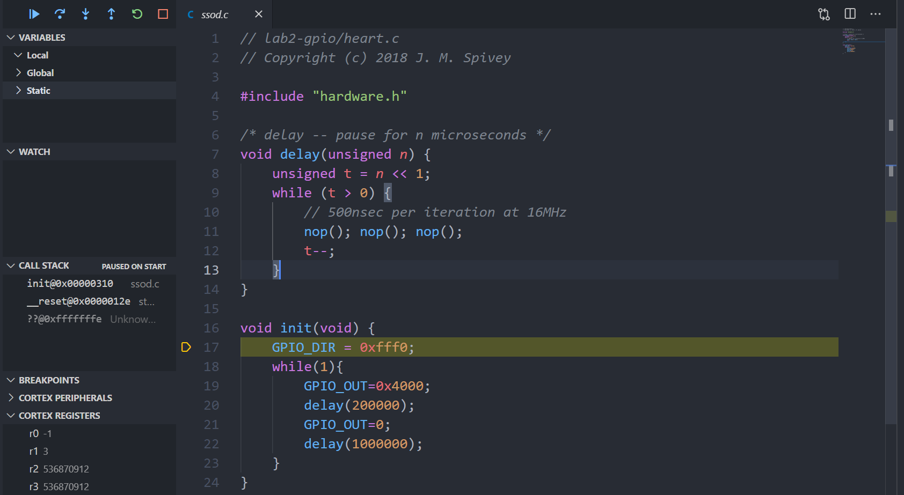

# Digital System
## ToolChain Install
Basically, you will need `gcc`, `gdb`, `make`, a serial terminal emulator.

### Windows
Note that WSL1 and WSL2 does not have full access to USB for now. All these package below works in native windows.

[GNU Toolchain](https://developer.arm.com/tools-and-software/open-source-software/developer-tools/gnu-toolchain/gnu-rm/downloads) used for compiling source file

[GNU Make](http://gnuwin32.sourceforge.net/packages/make.htm) Sadly not included in tool chain above and gnuwin32 make does not work well. Not required for the example project folder.

[OpenOCD Binary](https://github.com/xpack-dev-tools/openocd-xpack/releases) a bridge between GDB and device

[Tio Serial Terminal Emulator](https://github.com/tio/tio) Sadly no easy access to compiled binary online. One way to get it is through MSYS2. Not required for the example project folder.

Make sure binary are included in `PATH`.
```bash
> arm-none-eabi-g++.exe --version
arm-none-eabi-g++.exe (GNU Arm Embedded Toolchain 10-2020-q4-major) 10.2.1 20201103 (release) ...

> arm-none-eabi-gdb.exe --version
C:\Environment\GNUArm\bin\arm-none-eabi-gdb.exe: warning: ...

> openocd --version
xPack OpenOCD, x86_64 Open On-Chip Debugger 0.10.0+dev ...

> tio --help
Usage: /usr/bin/tio [<options>] <tty-device> ...

> make.exe
make: *** No targets specified and no makefile found.  Stop.
```
### MacOS & Linux
Instruction Missing. (Sadly Spivey removed the page.)

## VSCode
[ARM](https://marketplace.visualstudio.com/items?itemName=dan-c-underwood.arm) Highlighting for assembly files.

[C/C++](https://marketplace.visualstudio.com/items?itemName=ms-vscode.cpptools) Syntax Checking for C/C++ files.

[Cortex-Debug](https://marketplace.visualstudio.com/items?itemName=marus25.cortex-debug) Support loading elf to MicroBit. Debug binaries, showing arm assembly and register value at each step.

You can also install these extension by pressing `Crtl+P` and input 
```
ext install dan-c-underwood.arm
ext install ms-vscode.cpptools
ext install marus25.cortex-debug
```

## Example VSCode Project Folder
### Setup
- Open the folder in VSCode
- Open file [c_cpp_properties.json](project/.vscode/c_cpp_properties.json). Change `compilerPath` to address of ToolChain in your computer. If you are using system other than windows, you also need to change `intelliSenseMode`.
- Open [task.json](project/.vscode/task.json). Change the prefix of `libgcc.a` line to points to the correct file in your installation of compiler. 

### LED Example
- Open file `led.c`, press `F5` to start running and debugging
- You can now see breakpoint met at init function.
- After pressing `F5`, the program resumes, showing `SEVEN STARS OF DEATH` periodically. 


- Or you can also Press `F1`, input `disassembly`, choose `Cortex-Debug: Set Force Disassembly`, then choose `Force`. You will see the second picture below.


### Assembly Example
- Open file `foo_break`, press `F5` to run.
- Step into foo function, or add a breakpoint inside `foo.s`


### Assembly + Serial Terminal Example
- Open file `foo_serial.c`.
- Start serial port terminal emulator.
  - On windows, you may use puTTY.
  - Or `tio -b 9600 ttyS[x]` where [x] is the serial port number appear in device manager minus 1.
  - Mac and Linux missing.

### PS
- Project file stripped down from 2019-2020 Digital system course practical.
- Breakpoint at init function is specified in `launch.json`. Without this settings, initial debugger behavior is a bit weird. 
- You may need to change build task in `tasks.json` for later practicals.
