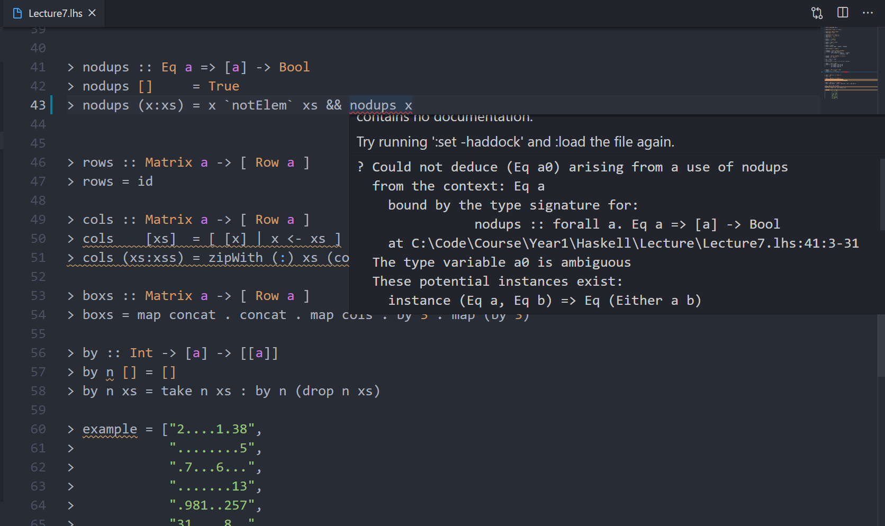
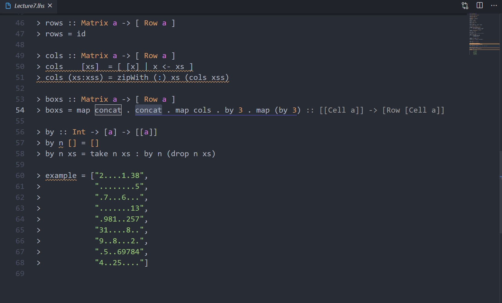
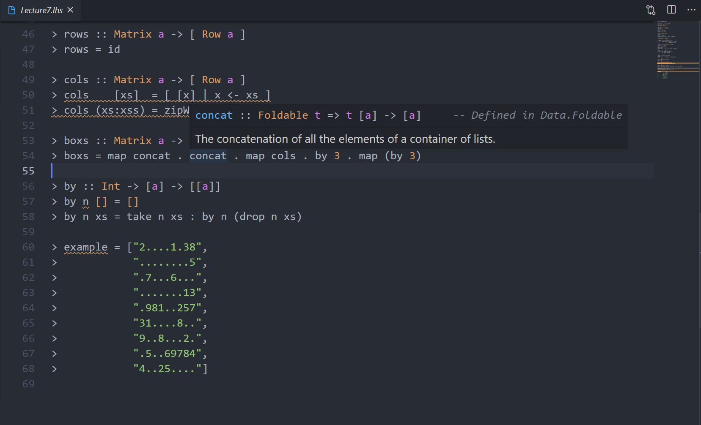

# Functional Programming (Haskell)
## Environment

[GHCi](https://www.haskell.org/downloads/#platform)

Make sure `ghci` is in your `PATH`
```bash
> ghci --version
The Glorious Glasgow Haskell Compilation System, version 8.10.4
```
## Recommended VSCode Extension
### [Simple GHC (Haskell) Integration](https://marketplace.visualstudio.com/items?itemName=dramforever.vscode-ghc-simple)
Code Highlighting. Syntax Checking. Documentation of functions. Checking Type of a expression.

Most useful and easy-to-use Haskell extension as it does not require installing any other software and works for single file (which covers all usage in first year)



It also seems to have inlined REPL feature which I haven't used before.

### [Code Runner](https://marketplace.visualstudio.com/items?itemName=formulahendry.code-runner)

Run code (using ghci).

## Unrecommended VSCode Extension
### [Haskell GHCi Debug Adapter Phoityne](https://marketplace.visualstudio.com/items?itemName=phoityne.phoityne-vscode)
The tool this extension requires is a little bit hard to install. In most cases in first year, you can find bugs in your code by running a few cases in the REPL.